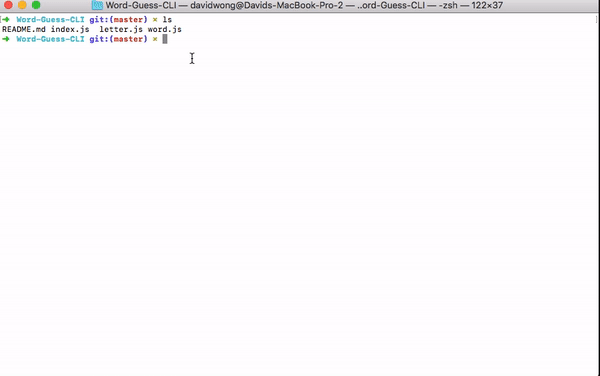

# Word-Guess-CLI

This application is created in the purpose of testing node and node module exports. A simple word guessing game on the terminal. 

### Installation

1. First you'll need the necessary application: Node and a command terminal. 
2. Clone the repository.
3. You will need download the necessary npm packages in the downloaded repository. 


## Packages
These are some of the packages needed to run the application.

1. Inquirer

```npm install inquirer```


## Demonstration 

**Functionality**

1. Takes in single letter guessses, if it's not a letter, it will return an message telling you to only input one letter at a time.
2. Prompts user if they want to start the game again once they've won or lost. 
3. This node application takes advantage of node module export function. This keeps multiple files for clean and efficient coding. 

**The gif shown below is the full demo of the node application**




